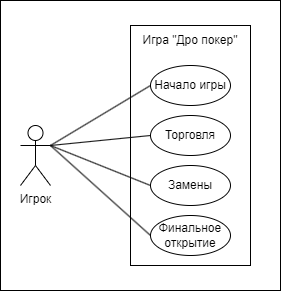

# Лабораторная работа 1
## Определение прецедентов

| Название прецедента     | Начать игру |
|:------------------------|:------------|
| Описание                | Игрок вводит свое имя и выбирает количество фишек из своего банка, на которые будет играть. После чего Игрок должен внести небольшой взнос – ante, для того, чтобы начать игру. Для начала игры, Игроков должно быть 2 и более.|
| Основной исполнитель    | Игрок |
| Предусловия             | Программа запущена. Имя игрока и количество фишек не введено.|
| Постусловия             | Начинается этап «Торговля».|
 
### Основной сценарий 
| Действия актора | Отклик системы |
|:----------------|:---------------|
| 1.Запустить игру |               |
|                  | 2. Предоставить игроку ввод его имени и количества фишек |
| 3.Ввести имя |  |
| 4.Ввести количество фишек |  |
|     | 5.Сохранить данные игрока |
|    6.Внести ante |  |
|     | 7.Проверить количество Игроков внесенных ante |
|     | 8.Все фишки перенести в банк игры |
|     | 9.Определить дилера |
|     | 10.Раздать каждому игроку по 5 карт |

   

| Название прецедента     | Торговля |
|:------------------------|:------------|
| Описание                | Игрок должен оценить свои карты и выполнить одно действие в свой ход. Варианты хода: пропустить ставку (pass), сбросить свои карты и закончить текущую игру (fold), сделать ставку (bet).|
| Основной исполнитель    | Игрок.|
| Основной сценарий       | 1. Игрок делает свой ход (pass, fold, bet); 2.	Ход переходит к следующему игроку по часовой стрелке.|
| Альтернативный сценарий | Если предыдущий игрок сделал ставку (bet), то следующий игрок обязан либо сбросить свои карты (fold), либо уровнять ставку до ставки предыдущего (call), либо поставить ставку больше (raise). Если на данном этапе остался один игрок не сбросивший карты, то банк забирает этот игрок, все карты сбрасываются и игра заканчивается.|
| Постусловия             | Круг завершает участник со статусом «Дилер». После того, как дилер сделал свою ставку, повышения уже не принимаются. Все поставленные фишки уходят в банк (pot).|
| Предусловия             | У двух и более игроков есть 5 карт на руке.|

   

| Название прецедента     | Замены |
|:------------------------|:------------|
| Описание                | Этот этап подразумевает то, что игрок может отказаться от одной или нескольких или даже всех своих карт, если он не удовлетворен раскладом. На замену отказавшимся картам, система выдает новые карты. Те карты, которые были сброшены, больше не участвуют в игре.|
| Основной исполнитель    | Игрок.|
| Основной сценарий       | 1. Игрок сбрасывает карты; 2. Система выдает новые карты; 3. Ход переходит к следующему игроку.|
| Альтернативный сценарий | 1. Игрок оставляет все карты; 2. Ход переходит к следующему игроку.|
| Постусловия             | Круг завершает участник со статусом «Дилер».|
| Предусловия             | Игроки уравняли ставку. Осталось более одного игрока.|

   

| Название прецедента     | Финальное открытие |
|:------------------------|:------------|
| Описание                | На данном этапе, игроки, которые остались с картами, участвуют в финальном открытии карт. Все игроки показывают свои карты. Побеждает тот, у кого оказывается самая сильная комбинация – он забирает весь банк.|
| Основной исполнитель    | Игрок.|
| Основной сценарий       | 1. Игроки открывают карты; 2. Система определяет игрока, у которого самая сильная комбинация; 3. Победитель забирает весь банк.|
| Альтернативный сценарий | Если к этому моменту остается только один игрок, он и забирает весь банк. Если у двух сидящих за покерным столом одинаковые руки, побеждает та, ранг карт в которой выше. Если у игроков имеются дополнительные карты (kickers), победитель определяется по более высокому их рангу. Если карты игроков не соответствуют ни одной комбинации, победитель определяется как обладатель карты самого высокого ранга.  Если победителя не удается определить ни одним из этих способов, банк делится между оставшимися игроками.|
| Постусловия             | Все карты собираются. Конец игры.|
| Предусловия             | Игроки уравняли ставку. Осталось более одного игрока.|
