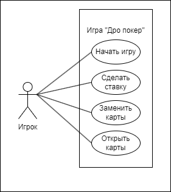

# Лабораторная работа 1
## Определение прецедентов

| Название прецедента     | Начать игру |
|:------------------------|:------------|
| Описание                | Игрок вводит свое имя и выбирает количество фишек из своего банка, на которые будет играть. После чего Игрок должен внести небольшой взнос – ante, для того, чтобы начать игру. Для начала игры, Игроков должно быть 2 и более.|
| Основной исполнитель    | Игрок |
| Предусловия             | Программа запущена. Имя игрока и количество фишек не введено.|
| Постусловия             | Начинается этап «Торговля».|

### Основной сценарий 

| Действия актора            | Отклик системы                                           |
|:---------------------------|:---------------------------------------------------------|
| 1. Запустить игру          |                                                          |
|                            | 2. Предоставить игроку ввод его имени и количества фишек |
| 3. Ввести имя              |                                                          |
| 4. Ввести количество фишек |                                                          |
|                            | 5. Сохранить данные игрока                               |
| 6. Внести ante             |                                                          |
|                            | 7. Проверить количество Игроков внесенных ante           |
|                            | 8. Все фишки перенести в банк игры                       |
|                            | 9. Определить дилера                                     |
|                            | 10. Раздать каждому игроку по 5 карт                     |

### Альтернативный сценарий 

3а. Если Игрок не вводит имя:

&ensp;&ensp;1. Система сообщает об ошибке ввода имени.

4а. Если Игрок не вводит количество фишек или вводит количество больше, чем его банк:

&ensp;&ensp;1. Система сообщает об ошибке ввода количества фишек.

6а. Если Игрок не вносит ante:

&ensp;&ensp;1. Система определяет Игрока, как не участвующий в игре.

7а. Если количество игроков равно одному:

&ensp;&ensp;1. Система возвращает ante;

&ensp;&ensp;2. Повторить пункты 6–7.

___

| Название прецедента     | Сделать ставку |
|:------------------------|:------------|
| Описание                | Игрок вводит количество фишек, которое хочет внести в банк игры.|
| Основной исполнитель    | Игрок |
| Предусловия             | У каждого игрока, который участвует в игре есть 5 карт. Начался этап «Торговля». |
| Постусловия             | Внести все ставки в банк игры.|

### Основной сценарий 

| Действия актора            | Отклик системы                                              |
|:---------------------------|:------------------------------------------------------------|
| 1. Ввести количество фишек  |                                                             |
|                            | 2. Запомнить ставку игрока                                   |
|                            | 3. Проверяется, что текущий игрок – не дилер                 |
|                            | 4. Проверяется, что следующий, после текущего игрока – дилер |
|                            | 5. Проверяется, одинаковая ли у всех Игроков ставка          |

### Альтернативный сценарий 

1а. Если Игрок не вводит ставку:

&ensp;&ensp;1. Игрок пропускает ставку;

&ensp;&ensp;2. Выполняются пункты 2–5.

1б. Если Игрок, после ставки дилера повышает ставку:

&ensp;&ensp;1. Система уведомляет Игрока, что ставка должна ровняться ставки дилера;

&ensp;&ensp;2. Выполняются пункты 1–4.

1в. Если Игрок сбрасывает карты:

&ensp;&ensp;1. Игрок больше не участвует в текущей игре; 

&ensp;&ensp;2. Ход переходит к следующему игроку;

&ensp;&ensp;3. Выполняются пункты 1–4.

1г. Если Игрок ставит ставку меньше последней ставки:

&ensp;&ensp;1. Система уведомляет Игрока, что ставка должна ровняться или быть больше последней ставки;

&ensp;&ensp;2. Выполняются пункты 1–4.

3а. Если текущий Игрок – дилер:

&ensp;&ensp;1. Выполняется пункт 5.

4а. Если следующий игрок не дилер:

&ensp;&ensp;1. Ход переходит к следующему игроку;

&ensp;&ensp;2. Выполняются пункты 1–5.

5а. Если ставка не одинаковая:

&ensp;&ensp;1. Ход переходит к следующему игроку;

&ensp;&ensp;2. Выполняются пункты 1–4.

*а. Если количество Игроков, не сбросивших карты равно одному:

&ensp;&ensp;1. Прибавить к его количеству фишек банк игры;

&ensp;&ensp;2. Закончить игру.

___

| Название прецедента     | Заменить карты |
|:------------------------|:------------|
| Описание                | Игрок может заменить любой количество карт со своей руки новыми картами из колоды.|
| Основной исполнитель    | Игрок |
| Предусловия             | Все ставки учтены, этап «Замены» еще не начинался и Игроков с картами осталось два и более.|
| Постусловия             | Завершается этап «Замены». Начинается этап «Торговля». |

### Основной сценарий 

| Действия актора            | Отклик системы                                              |
|:---------------------------|:------------------------------------------------------------|
| 1. Просит замену карт   |                                                             |
| 2. Отдает от 1 до 5 карт       |                                    |
|                            | 3. Выдается столько карт, сколько отдал Игрок                 |
|                            | 4. Проверяется, текущий Игрок – дилер |

### Альтернативный сценарий 

1а. Если Игрок не просит замену карт:

&ensp;&ensp;1. Выполняется пункт 4.

4а. Если текущий игрок не дилер:

&ensp;&ensp;1. Ход переходит к следующему игроку.

___

| Название прецедента     | Открыть карты  |
|:------------------------|:------------|
| Описание                | Игроки дошедшие до этапа финального открытия должны открыть свои карты и определить победителя.|
| Основной исполнитель    | Игрок|
| Предусловия             | Все ставки учтены, этап «Замены» завершился и Игроков с картами осталось два и более. |
| Постусловия             | Игра завершается.|

### Основной сценарий 

| Действия актора             | Отклик системы                                                |
|:----------------------------|:--------------------------------------------------------------|
| 1. Открыть карты            |                                                               |
|                             | 2. Проверить, что все Игроки открыли карты                    |
|                             | 3. Определить победителя                                      |
|                             | 4. Прибавить к количеству фишек победившего Игрока, банк игры |

### Альтернативный сценарий 

2а. Если не все Игроки открыли карты:

&ensp;&ensp;1. Ход переходит к следующему Игроку. Выполняются пункты 1–4.

3а. Если не удалось определить победителя:

&ensp;&ensp;1. Поделить банк на число Игроков открывших карты;

&ensp;&ensp;2. Прибавить к фишкам Игрока его долю.
