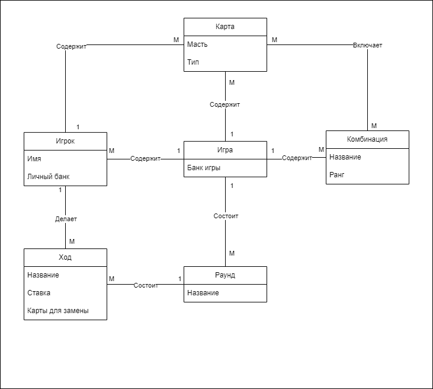

# Лабораторная работа 2
## Создание модели предметной области

### Связи
Игра состоит из нескольких раундов

Игра содержит несколько игроков и много комбинаций, которые может собрать игрок

Игра включает одну колоду карт

Колода содержит много карт

Игрок содержит несколько карт

Комбинация включает несколько карт

Раунд состоит из нескольких ходов

Игрок делает несколько ходов
