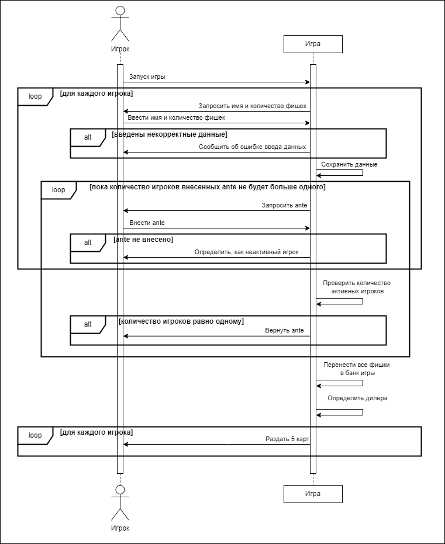
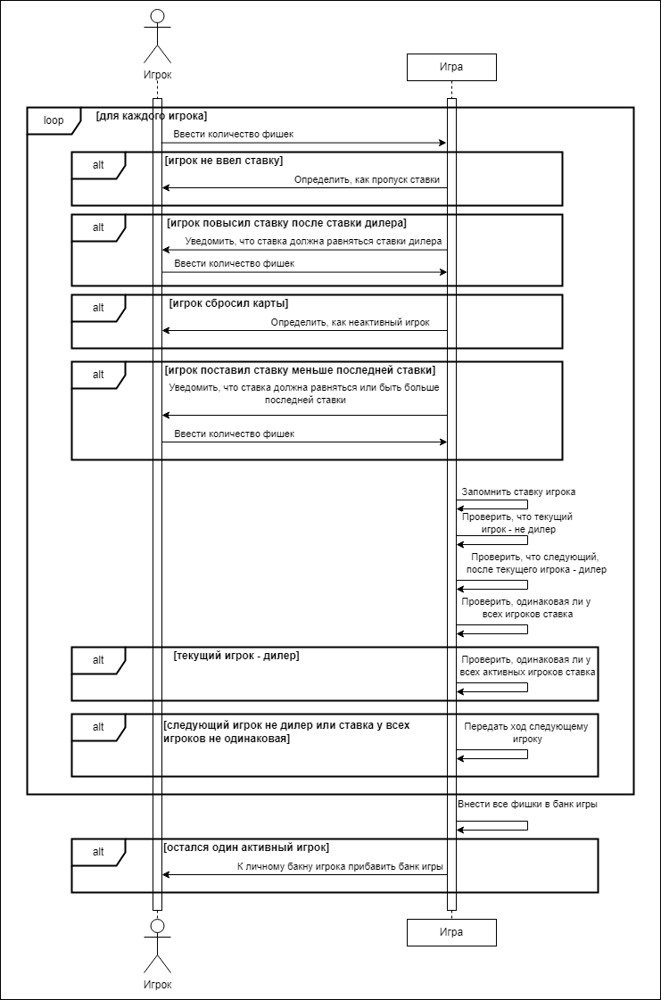
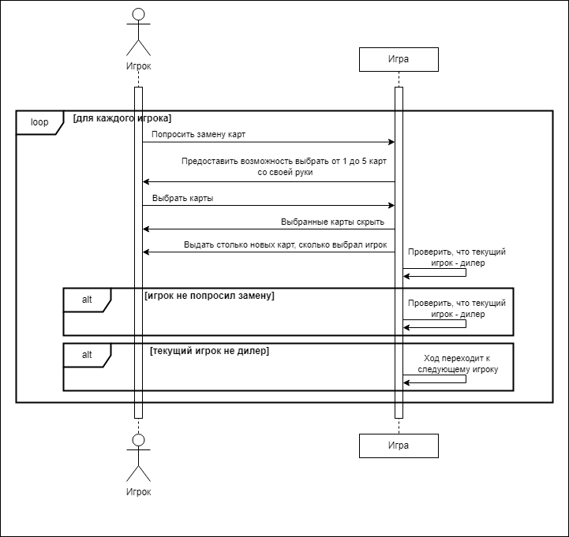
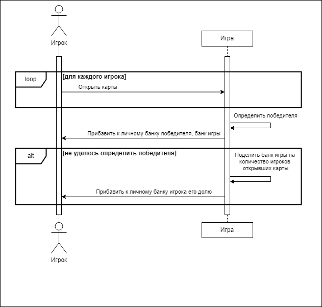

# Лабораторная работа 3
## Создание системных диаграмм последовательностей

### Начать игру

| Действие    | Запуск игры |
|:------------|:-|
| Ссылки      | Преценденты: "Начать игру" |
| Предусловия | Игра не запущена |
| Постусловия | Игра запущена |

| Действие    | Запросить имя и количество фишек |
|:------------|:-|
| Ссылки      | Преценденты: "Начать игру" |
| Предусловия | Игра запущена |
| Постусловия | Появились поля для ввода данных |

| Действие    | Ввести имя и количество фишек |
|:------------|:-|
| Ссылки      | Преценденты: "Начать игру" |
| Предусловия | Появились поля для ввода данных |
| Постусловия | Данные прошли проверку на корректность |

| Действие    | Сообщить об ошибке ввода данных |
|:------------|:-|
| Ссылки      | Преценденты: "Начать игру" |
| Предусловия | Данные введены некорректно |
| Постусловия | Появилась информация об ошибке |

| Действие    | Сохранить данные |
|:------------|:-|
| Ссылки      | Преценденты: "Начать игру" |
| Предусловия | Данные корректны |
| Постусловия | Данные сохранены |

| Действие    | Запросить ante |
|:------------|:-|
| Ссылки      | Преценденты: "Начать игру" |
| Предусловия | Данные об игроке сохранены |
| Постусловия | Появилась кнопка "Внести ante" и "Не вносить ante" |

| Действие    | Внести ante |
|:------------|:-|
| Ссылки      | Преценденты: "Начать игру" |
| Предусловия | Нажата кнопка "Внести ante" |
| Постусловия | С личного банка игрока вычиталось ante |

| Действие    | Определить, как неактивный игрок |
|:------------|:-|
| Ссылки      | Преценденты: "Начать игру" |
| Предусловия | Нажата кнопка "Не вносить ante" |
| Постусловия | Игрок стал неактивным |

| Действие    | Проверить количество активных игроков |
|:------------|:-|
| Ссылки      | Преценденты: "Начать игру" |
| Предусловия | Количество активных игроков больше одного |
| Постусловия | Суммированы все внесеные ante |

| Действие    | Вернуть ante |
|:------------|:-|
| Ссылки      | Преценденты: "Начать игру" |
| Предусловия | Количество активных игроков равно одному |
| Постусловия | Личный банк игрока увеличился на ante |

| Действие    | Перенести все фишки в банк игры |
|:------------|:-|
| Ссылки      | Преценденты: "Начать игру", "Сделать ставку" |
| Предусловия | Суммированы все внесеные фишки |
| Постусловия | Банк игры пополнен |

| Действие    | Определить дилера |
|:------------|:-|
| Ссылки      | Преценденты: "Начать игру" |
| Предусловия | Банк игры пополнен |
| Постусловия | Определен дилер |

| Действие    | Раздать 5 карт |
|:------------|:-|
| Ссылки      | Преценденты: "Начать игру" |
| Предусловия | Определен дилер |
| Постусловия | Каждый игрок имеет 5 карт |

### Сделать ставку

| Действие    | Ввести количество фишек |
|:------------|:-|
| Ссылки      | Преценденты: "Сделать ставку" |
| Предусловия | Настал ход игрока |
| Постусловия | Ставка сохранена |

| Действие    | Определить, как пропуск ставки |
|:------------|:-|
| Ссылки      | Преценденты: "Сделать ставку" |
| Предусловия | Игрок не ввел ставку |
| Постусловия | Ход сохранен |

| Действие    | Уведомить, что ставка должна равняться ставки дилера |
|:------------|:-|
| Ссылки      | Преценденты: "Сделать ставку" |
| Предусловия | Игрок повысил ставку после ставки дилера |
| Постусловия | Предоставлена возможность поставить ставку или сбросить карты |

| Действие    | Определить, как неактивный игрок |
|:------------|:-|
| Ссылки      | Преценденты: "Сделать ставку" |
| Предусловия | Игрок сбросил карты |
| Постусловия | Ход сохранен |

| Действие    | Уведомить, что ставка должна равняться или быть больше последней ставки |
|:------------|:-|
| Ссылки      | Преценденты: "Сделать ставку" |
| Предусловия | Игрок поставил ставку меньше последней ставки |
| Постусловия | Предоставлена возможность поставить ставку или сбросить карты |

| Действие    | Запомнить ставку игрока |
|:------------|:-|
| Ссылки      | Преценденты: "Сделать ставку" |
| Предусловия | Введена ставка, удовлетворяющая всем условиям |
| Постусловия | Ставка игрока сохранена |

| Действие    | Проверить, что текущий игрок - не дилер |
|:------------|:-|
| Ссылки      | Преценденты: "Сделать ставку" |
| Предусловия | Ставка игрока сохранена |
| Постусловия | Подтверждено, что текущий игрок не дилер |

| Действие    | Проверить, что следующий, после текущего игрока - дилер |
|:------------|:-|
| Ссылки      | Преценденты: "Сделать ставку" |
| Предусловия | Подтверждено, что текущий игрок не дилер |
| Постусловия | Подтверждено, что следующий, после текущего игрока дилер |

| Действие    | Проверить, одинаковая ли у всех игроков ставка |
|:------------|:-|
| Ссылки      | Преценденты: "Сделать ставку" |
| Предусловия | Текущий игрок - дилер или все игроки сделали свои ставки |
| Постусловия | Суммированы все внесеные фишки |

| Действие    | К личному бакну игрока прибавить банк игры |
|:------------|:-|
| Ссылки      | Преценденты: "Сделать ставку" |
| Предусловия | Остался один активный игрок |
| Постусловия | К личному банку игрока прибавлен банк игры |

### Заменить карты

| Действие    | Попросить замену карт |
|:------------|:-|
| Ссылки      | Преценденты: "Заменить карты" |
| Предусловия | Начался этап "Торговля" |
| Постусловия | Сохранить выбор |

| Действие    | Предоставить возможность выбрать от 1 до 5 карт со своей руки |
|:------------|:-|
| Ссылки      | Преценденты: "Заменить карты" |
| Предусловия | Игрок попросил заменить карты |
| Постусловия | Предоставлен выбор карт |

| Действие    | Выбрать карты |
|:------------|:-|
| Ссылки      | Преценденты: "Заменить карты" |
| Предусловия | Предоставлен выбор карт |
| Постусловия | Выбраны карты для замены |

| Действие    | Выбранные карты скрыть |
|:------------|:-|
| Ссылки      | Преценденты: "Заменить карты" |
| Предусловия | Выбраны карты для замены |
| Постусловия | Скрыты выбранные карты |

| Действие    | Выдать столько новых карт, сколько выбрал игрок |
|:------------|:-|
| Ссылки      | Преценденты: "Заменить карты" |
| Предусловия | Скрыты выбранные карты |
| Постусловия | Выданы новые карты |

| Действие    | Проверить, что текущий игрок - дилер |
|:------------|:-|
| Ссылки      | Преценденты: "Заменить карты" |
| Предусловия | Игрок не попросил замену или замена уже произведена |
| Постусловия | Конец этапа "Торговля" |

| Действие    | Ход переходит к следующему игроку |
|:------------|:-|
| Ссылки      | Преценденты: "Заменить карты" |
| Предусловия | Текущий игрок не дилер |
| Постусловия | Начался ход следующего игрока |

### Открыть карты

| Действие    | Открыть карты |
|:------------|:-|
| Ссылки      | Преценденты: "Открыть карты" |
| Предусловия | Начался этап "Финальное открытие" |
| Постусловия | Открыты карты игрока |

| Действие    | Определить победителя |
|:------------|:-|
| Ссылки      | Преценденты: "Открыть карты" |
| Предусловия | Все игроки открыли карты |
| Постусловия | Определен победитель |

| Действие    | Прибавить к личному банку победителя, банк игры |
|:------------|:-|
| Ссылки      | Преценденты: "Открыть карты" |
| Предусловия | Определен победитель |
| Постусловия | Банк игрока пополнен |

| Действие    | Поделить банк игры на количество игроков открывших карты |
|:------------|:-|
| Ссылки      | Преценденты: "Открыть карты" |
| Предусловия | Не удалось определить победителя |
| Постусловия | Банк игры поделен на равные части |

| Действие    | Прибавить к личному банку игрока его долю |
|:------------|:-|
| Ссылки      | Преценденты: "Открыть карты" |
| Предусловия | Банк игры поделен на равные части |
| Постусловия | Банки игроков пополнены |
