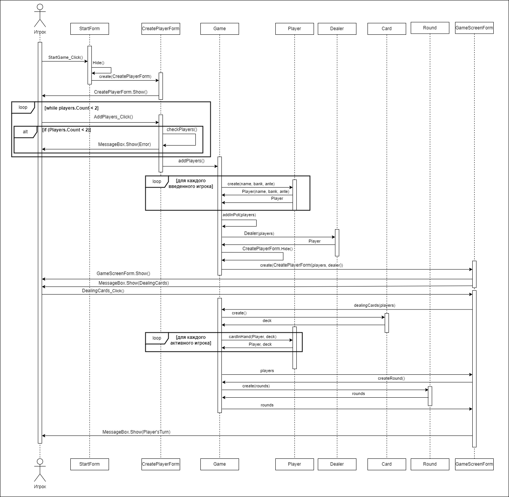
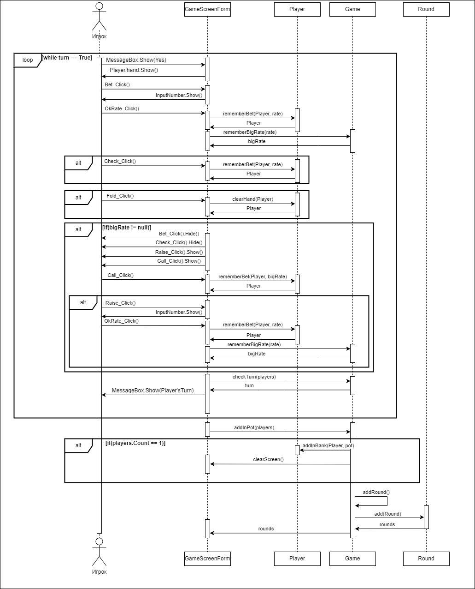
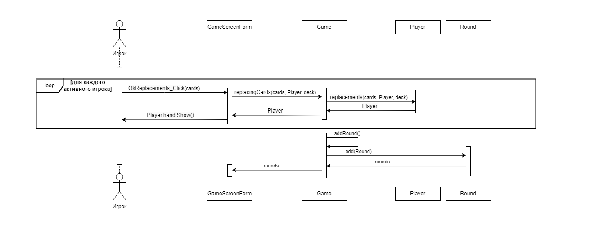
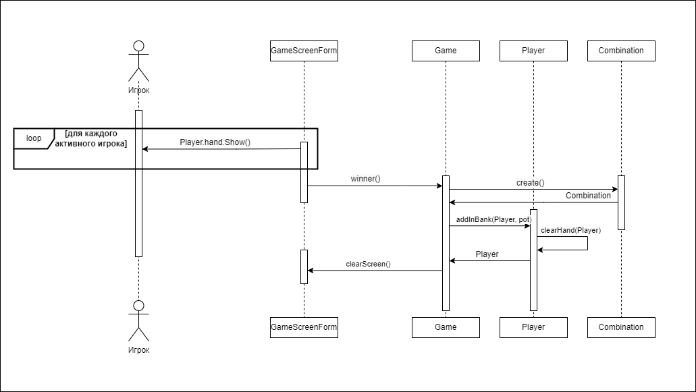

# Лабораторная работа 4
## Создание диаграмм взаимодействия 

### Начать игру

| Действие    | StartGame_Click() |
|:------------|:-|
| Ссылки      | Преценденты: "Начать игру" |
| Предусловия | Игра запущена |
| Постусловия | Открыта форма создания игроков |

| Действие    | Hide() |
|:------------|:-|
| Ссылки      | Преценденты: "Начать игру" |
| Предусловия | Нажата кнопка начала игры |
| Постусловия | Скрыта начальная форма |

| Действие    | create(CreatePlayerForm) |
|:------------|:-|
| Ссылки      | Преценденты: "Начать игру" |
| Предусловия | Нажата кнопка начала игры |
| Постусловия | Создан экземпляр формы |

| Действие    | CreatePlayerForm.Show() |
|:------------|:-|
| Ссылки      | Преценденты: "Начать игру" |
| Предусловия | Нажата кнопка начала игры |
| Постусловия | Открыта форма создания игроков |

| Действие    | AddPlayers_Click() |
|:------------|:-|
| Ссылки      | Преценденты: "Начать игру" |
| Предусловия | Нажата кнопка добавления игроков |
| Постусловия | Открыта основная форма игры |

| Действие    | checkPlayers() |
|:------------|:-|
| Ссылки      | Преценденты: "Начать игру" |
| Предусловия | Нажата кнопка добавления игроков |
| Постусловия | Проверено количество игроков |

| Действие    | MessageBox.Show(Error) |
|:------------|:-|
| Ссылки      | Преценденты: "Начать игру" |
| Предусловия | Количество игроков меньше двух |
| Постусловия | Выведена ошибка добавления |

| Действие    | addPlayers() |
|:------------|:-|
| Ссылки      | Преценденты: "Начать игру" |
| Предусловия | Количество игроков больше или равно двум |
| Постусловия | Открыта основная форма игры |

| Действие    | create(name, bank, ante) |
|:------------|:-|
| Ссылки      | Преценденты: "Начать игру" |
| Предусловия | Количество игроков больше или равно двум |
| Постусловия | Созданы экземпляры всех игроков |

| Действие    | Player(name, bank, ante) |
|:------------|:-|
| Ссылки      | Преценденты: "Начать игру" |
| Предусловия | Создан экземпляр игрока |
| Постусловия | Player добавлен в Game |

| Действие    | addInPot(players) |
|:------------|:-|
| Ссылки      | Преценденты: "Начать игру" |
| Предусловия | Созданы экземпляры всех игроков |
| Постусловия | Банк игры увеличен на внесенные анте |

| Действие    | Dealer(players) |
|:------------|:-|
| Ссылки      | Преценденты: "Начать игру" |
| Предусловия | Банк игры увеличен на внесенные анте |
| Постусловия | Определен дилер |

| Действие    | CreatePlayerForm.Hide() |
|:------------|:-|
| Ссылки      | Преценденты: "Начать игру" |
| Предусловия | Определен дилер |
| Постусловия | Скрыта форма добавления игроков |

| Действие    | create(CreatePlayerForm(players, dealer)) |
|:------------|:-|
| Ссылки      | Преценденты: "Начать игру" |
| Предусловия | Определен дилер |
| Постусловия | Создан экземпляр основной формы игры |

| Действие    | GameScreenForm.Show() |
|:------------|:-|
| Ссылки      | Преценденты: "Начать игру" |
| Предусловия | Создан экземпляр основной формы игры |
| Постусловия | Открыта основная форма игры |

| Действие    | MessageBox.Show(DealingCards) |
|:------------|:-|
| Ссылки      | Преценденты: "Начать игру" |
| Предусловия | Открыта основная форма игры |
| Постусловия | Открыто окно раздачи карт |

| Действие    | DealingCards_Click() |
|:------------|:-|
| Ссылки      | Преценденты: "Начать игру" |
| Предусловия | Открыто окно раздачи карт |
| Постусловия | Открыто окно для подтверждения игрока |

| Действие    | dealingCards(players) |
|:------------|:-|
| Ссылки      | Преценденты: "Начать игру" |
| Предусловия | Нажата кнопка раздачи карт |
| Постусловия | Каждому игроку присвоены пять карт |

| Действие    | create() |
|:------------|:-|
| Ссылки      | Преценденты: "Начать игру" |
| Предусловия | Нажата кнопка раздачи карт |
| Постусловия | Создан экземпляр колоды |

| Действие    | cardInHand(Player, deck) |
|:------------|:-|
| Ссылки      | Преценденты: "Начать игру" |
| Предусловия | Создан экземпляр колоды |
| Постусловия | Каждому игроку присвоены пять карт |

| Действие    | createRound() |
|:------------|:-|
| Ссылки      | Преценденты: "Начать игру" |
| Предусловия | Каждому игроку присвоены пять карт |
| Постусловия | Определен раунд |

| Действие    | create(rounds) |
|:------------|:-|
| Ссылки      | Преценденты: "Начать игру" |
| Предусловия | Создан экземпляр раунда |
| Постусловия | Определен раунд |

| Действие    | MessageBox.Show(Player'sTurn) |
|:------------|:-|
| Ссылки      | Преценденты: "Начать игру" |
| Предусловия | Определен раунд |
| Постусловия | Открыто окно для подтверждения игрока |

### Сделать ставку

| Действие    | MessageBox.Show(Yes) |
|:------------|:-|
| Ссылки      | Преценденты: "Сделать ставку" |
| Предусловия | Раунд начался |
| Постусловия | Открыта окно подтверждения игрока |

| Действие    | Player.hand.Show() |
|:------------|:-|
| Ссылки      | Преценденты: "Сделать ставку", "Заменить карты", "Открыть карты"  |
| Предусловия | Игрок нажал кнопку подтверждения |
| Постусловия | Открыты карты игрока |

| Действие    | Bet_Click() |
|:------------|:-|
| Ссылки      | Преценденты: "Сделать ставку" |
| Предусловия | Открыты карты игрока |
| Постусловия | Поле ввода ставки активна |

| Действие    | InputNumber.Show() |
|:------------|:-|
| Ссылки      | Преценденты: "Сделать ставку" |
| Предусловия | Игрок нажал кнопку Bet |
| Постусловия | Поле ввода ставки активна |

| Действие    | OkRate_Click() |
|:------------|:-|
| Ссылки      | Преценденты: "Сделать ставку" |
| Предусловия | Игрок ввел ставку |
| Постусловия | Ход переходит к другому игроку |

| Действие    | rememberBet(Player, rate) |
|:------------|:-|
| Ссылки      | Преценденты: "Сделать ставку" |
| Предусловия | Игрок нажал кнопку подтверждения ставки |
| Постусловия | Ставка игрока сохранена |

| Действие    | rememberBigRate(rate) |
|:------------|:-|
| Ссылки      | Преценденты: "Сделать ставку" |
| Предусловия | Игрок нажал кнопку подтверждения ставки |
| Постусловия | Ставка игрока сохранена, как самая высокая |

| Действие    | Check_Click() |
|:------------|:-|
| Ссылки      | Преценденты: "Сделать ставку" |
| Предусловия | Самая высокая ставка не сохранена |
| Постусловия | Ставка игрока сохранена |

| Действие    | Fold_Click() |
|:------------|:-|
| Ссылки      | Преценденты: "Сделать ставку" |
| Предусловия | Игрок нажал кнопку подтверждения |
| Постусловия | Очищены карты игрока |

| Действие    | clearHand(Player) |
|:------------|:-|
| Ссылки      | Преценденты: "Сделать ставку", "Открыть карты" |
| Предусловия | Игрок нажал кнопку Fold или начался этап "финальное открытие" |
| Постусловия | Очищены карты игрока |

| Действие    | Bet_Click().Hide() |
|:------------|:-|
| Ссылки      | Преценденты: "Сделать ставку" |
| Предусловия | Самая высокая ставка сохранена |
| Постусловия | Кнопка Bet скрыта |

| Действие    | Check_Click().Hide() |
|:------------|:-|
| Ссылки      | Преценденты: "Сделать ставку" |
| Предусловия | Самая высокая ставка сохранена |
| Постусловия | Кнопка Check скрыта |

| Действие    | Raise_Click().Show() |
|:------------|:-|
| Ссылки      | Преценденты: "Сделать ставку" |
| Предусловия | Самая высокая ставка сохранена |
| Постусловия | Кнопка Raise открыта |

| Действие    | Call_Click().Show() |
|:------------|:-|
| Ссылки      | Преценденты: "Сделать ставку" |
| Предусловия | Самая высокая ставка сохранена |
| Постусловия | Кнопка Call открыта |

| Действие    | Call_Click() |
|:------------|:-|
| Ссылки      | Преценденты: "Сделать ставку" |
| Предусловия | Самая высокая ставка сохранена |
| Постусловия | Ставка игрока сохранена |

| Действие    | Raise_Click() |
|:------------|:-|
| Ссылки      | Преценденты: "Сделать ставку" |
| Предусловия | Самая высокая ставка сохранена |
| Постусловия | Поле ввода ставки активно |

| Действие    | checkTurn(players) |
|:------------|:-|
| Ссылки      | Преценденты: "Сделать ставку" |
| Предусловия | Ставка игрока сохранена |
| Постусловия | Определ конец или продолжение раунда  |

| Действие    | addInPot(players) |
|:------------|:-|
| Ссылки      | Преценденты: "Сделать ставку" |
| Предусловия | Определ конец раунда |
| Постусловия | Все ставки сохранены в банке игры  |

| Действие    | addInBank(Player, pot) |
|:------------|:-|
| Ссылки      | Преценденты: "Сделать ставку", "Открыть карты" |
| Предусловия | Остался один активный игрок или начался этап "Финальное открытие"|
| Постусловия | Личный банк игрока пополнен  |

| Действие    | clearScreen() |
|:------------|:-|
| Ссылки      | Преценденты: "Сделать ставку" |
| Предусловия | Личный банк игрока пополнен |
| Постусловия | Началась новая игра |

| Действие    | addRound() |
|:------------|:-|
| Ссылки      | Преценденты: "Сделать ставку" |
| Предусловия | Все ставки сохранены в банке игры |
| Постусловия | Определен следующий раунд |

| Действие    | add(Round) |
|:------------|:-|
| Ссылки      | Преценденты: "Сделать ставку", "Заменить карты" |
| Предусловия | Все ставки сохранены в банке игры |
| Постусловия | Раунд сохранен в Game |

### Заменить карты

| Действие    | OkReplacements_Click(cards) |
|:------------|:-|
| Ссылки      | Преценденты: "Заменить карты" |
| Предусловия | Начался раунд "Замены" |
| Постусловия | Показаны карты игрока |

| Действие    | replacingСards(cards, Player, deck) |
|:------------|:-|
| Ссылки      | Преценденты: "Заменить карты" |
| Предусловия | Выбраны карты |
| Постусловия | Карты заменены |

| Действие    | replacements(cards, Player, deck) |
|:------------|:-|
| Ссылки      | Преценденты: "Заменить карты" |
| Предусловия | Выбраны карты |
| Постусловия | Карты заменены |

### Открыть карты

| Действие    | winner() |
|:------------|:-|
| Ссылки      | Преценденты: "Открыть карты" |
| Предусловия | Начался этап "Финальное открытие" |
| Постусловия | Определен победитель |

